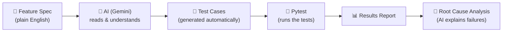
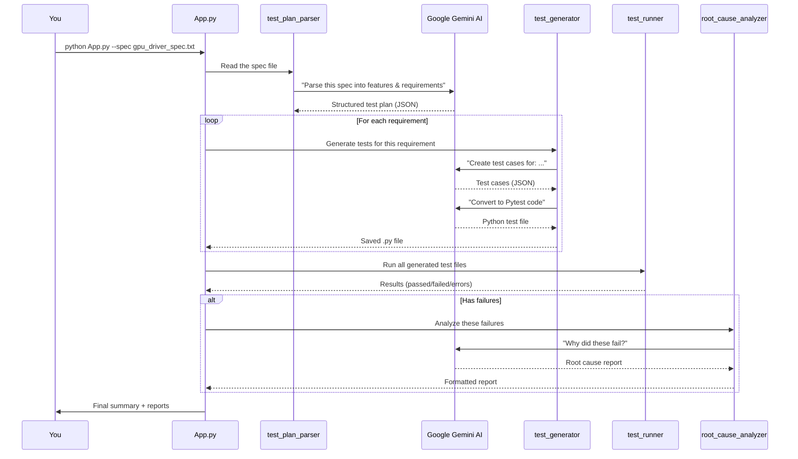

# 🧪 AI-Powered Test Case Generation Framework — Beginner's Guide

## What Does This Project Do?

Imagine you're a QA engineer at NVIDIA. You receive a **feature specification** document (a plain English description of how something should work — like "the GPU driver should allocate memory in blocks from 4KB to 48GB"). Normally, you'd have to **manually** read through the spec and write dozens of test cases by hand. That's slow and error-prone.

**This project automates that entire process using AI (Google Gemini):**



**In short:** You give it a document describing what software should do → AI generates test cases → runs them → and if tests fail, AI tells you *why* they failed.

---

## How Each File & Folder Works

### 📁 Project Structure Overview

```
NVIDIA/
├── App.py                  ← 🚪 Entry point (you run this)
├── config.py               ← ⚙️ Settings (API keys, paths)
├── requirements.txt        ← 📦 Python packages needed
├── .env.example            ← 🔑 Template for your API key
│
├── core/                   ← 🧠 The "brain" — AI-powered logic
│   ├── llm_engine.py       ←   Talks to Google Gemini
│   ├── test_plan_parser.py ←   Reads specs, extracts test plan
│   ├── test_generator.py   ←   Generates test cases from plan
│   └── root_cause_analyzer.py ← Analyzes why tests failed
│
├── runner/                 ← 🏃 The "legs" — runs tests
│   ├── test_runner.py      ←   Executes Pytest
│   ├── result_aggregator.py ←  Summarizes results
│   └── logger.py           ←   Color-coded console logging
│
├── templates/              ← 📝 AI prompt templates
│   └── prompts.py          ←   Instructions the AI follows
│
├── tests/                  ← ✅ Unit tests for the framework itself
│   └── test_framework.py   ←   Tests that our code works correctly
│
├── sample_specs/           ← 📄 Example specification documents
│   └── gpu_driver_spec.txt ←   NVIDIA GPU memory management spec
│
├── generated_tests/        ← 📂 AI-generated test files land here
└── logs/                   ← 📋 Log files & reports
```

---

### File-by-File Explanation

#### 🚪 [App.py](file:///d:/D,Drive/NVIDIA/App.py) — The Entry Point
**Think of it like:** the receptionist at a hospital — takes your request and routes it.

This is the file you run. It:
1. Reads your command-line arguments (which spec file to use, etc.)
2. Calls the right functions in the right order
3. Orchestrates the full pipeline: parse spec → generate tests → run tests → analyze failures

#### ⚙️ [config.py](file:///d:/D,Drive/NVIDIA/config.py) — Settings
**Think of it like:** a control panel with all the dials and switches.

Stores:
- Your **Google Gemini API key** (how the AI authenticates)
- Which AI **model** to use (`gemini-2.0-flash`)
- Where to save generated tests and logs
- AI parameters like *temperature* (how creative the AI should be; lower = more deterministic)

#### 🧠 [core/llm_engine.py](file:///d:/D,Drive/NVIDIA/core/llm_engine.py) — The AI Connection
**Think of it like:** a phone line to Google's AI brain.

- Creates a connection to Google Gemini via LangChain (a popular AI framework)
- Sends prompts and receives responses
- Has retry logic — if the AI call fails, it tries again (up to 3 times)
- [invoke_chain()](file:///d:/D,Drive/NVIDIA/core/llm_engine.py#41-80) → sends a prompt, gets text back
- [invoke_chain_json()](file:///d:/D,Drive/NVIDIA/core/llm_engine.py#82-110) → sends a prompt, gets structured JSON back

#### 📝 [templates/prompts.py](file:///d:/D,Drive/NVIDIA/templates/prompts.py) — AI Instructions
**Think of it like:** a script that tells the AI exactly *how* to think.

Contains 4 prompt templates:
1. **Test Case Generation** — "You are a QA engineer, generate test cases from this requirement..."
2. **Test Plan Parsing** — "You are a QA architect, extract features from this spec..."
3. **Root Cause Analysis** — "You are a debugging expert, analyze these failures..."
4. **Pytest Code Generation** — "You are a Python test engineer, convert test cases into Pytest code..."

#### 🔍 [core/test_plan_parser.py](file:///d:/D,Drive/NVIDIA/core/test_plan_parser.py) — Spec Reader
**Think of it like:** a translator that converts a document into a structured plan.

- Takes a plain-English spec file (like [gpu_driver_spec.txt](file:///d:/D,Drive/NVIDIA/sample_specs/gpu_driver_spec.txt))
- Sends it to AI with the "test plan parsing" prompt
- Gets back a structured plan: features, requirements, risk levels
- Example: it reads "*Memory allocation from 4KB to 48GB*" and outputs a Feature with specific testable requirements

#### 🧪 [core/test_generator.py](file:///d:/D,Drive/NVIDIA/core/test_generator.py) — Test Case Factory
**Think of it like:** a factory that manufactures test cases.

- Takes each requirement from the test plan
- Sends it to AI: "*Generate test cases for: memory allocation must support 4KB to 48GB*"
- Gets back structured test cases (test name, steps, expected result, priority)
- Then asks AI to convert those into **real, runnable Python/Pytest code**
- Saves both the JSON record and the [.py](file:///d:/D,Drive/NVIDIA/App.py) test file

#### 🔬 [core/root_cause_analyzer.py](file:///d:/D,Drive/NVIDIA/core/root_cause_analyzer.py) — Failure Detective
**Think of it like:** a doctor diagnosing why something is sick.

- When tests fail, it collects the failure data (error messages, tracebacks)
- Sends them to AI: "*Why did these tests fail? What's the root cause?*"
- Gets back: probable cause, severity, suggested fix, affected component
- Outputs a nicely formatted report

#### 🏃 [runner/test_runner.py](file:///d:/D,Drive/NVIDIA/runner/test_runner.py) — Test Executor
**Think of it like:** a robot that presses the "run" button and records what happens.

- Takes the generated [.py](file:///d:/D,Drive/NVIDIA/App.py) test files
- Runs them using Pytest (Python's standard testing framework)
- Captures output: which tests passed, failed, errored, or were skipped
- Returns structured results with pass rate, duration, etc.

#### 📊 [runner/result_aggregator.py](file:///d:/D,Drive/NVIDIA/runner/result_aggregator.py) — Results Summarizer
**Think of it like:** a scoreboard that shows the final tally.

- Takes raw test results and creates a summary
- Formats a nice box in the console showing: total tests, passed, failed, pass rate
- Saves the summary as JSON for CI/CD pipelines

#### 🎨 [runner/logger.py](file:///d:/D,Drive/NVIDIA/runner/logger.py) — Pretty Logging
**Think of it like:** a color printer for the console.

- Green for info messages, yellow for warnings, red for errors
- Logs to both the console (with colors) and a file (without colors)
- Uses the `colorama` library to make Windows terminal colors work

#### ✅ [tests/test_framework.py](file:///d:/D,Drive/NVIDIA/tests/test_framework.py) — Self-Tests
**Think of it like:** the factory testing its own machines before making products.

- 21 unit tests that verify the framework's own code works correctly
- Tests config loading, prompt templates, data models, result aggregation, etc.
- These tests don't call the actual AI — they test the *structure* of the code

---

## The Complete Flow (Step by Step)



---

## 🚀 How to Execute This Project

### Step 1: Get a Google Gemini API Key

1. Go to [Google AI Studio](https://aistudio.google.com/apikey)
2. Sign in with your Google account
3. Click **"Create API Key"**
4. Copy the key (it looks like `AIzaSy...`)

### Step 2: Create your `.env` file

In the project root (`d:\D,Drive\NVIDIA\`), create a file named **`.env`** with:

```env
GOOGLE_API_KEY=paste-your-actual-key-here
```

> [!CAUTION]
> Never commit your `.env` file to Git — it contains your secret API key!

### Step 3: Run the Project

Open a terminal in the project directory and run:

```powershell
# Activate the virtual environment
.venv\Scripts\Activate

# Option A: Generate tests from the sample GPU driver spec
python App.py --spec sample_specs/gpu_driver_spec.txt

# Option B: Generate tests from a one-line requirement
python App.py --requirement "User login must validate email format and reject disposable emails"

# Option C: Generate tests WITHOUT running them
python App.py --spec sample_specs/gpu_driver_spec.txt --generate-only

# Option D: Run previously generated tests only
python App.py --run-only generated_tests/

# Show help
python App.py --help
```

### Step 4: Check the Output

After running, look at:
- **`generated_tests/`** — the AI-generated Pytest files
- **`logs/`** — log file and reports
- **Console** — colorful summary with pass/fail counts

> [!IMPORTANT]
> The generated tests use placeholder/mock assertions since they test GPU hardware concepts. 
> In a real NVIDIA project, you'd replace the TODO comments with actual driver API calls.
